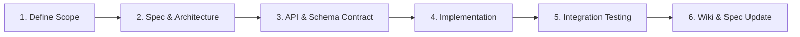

# 🎬 CineMeow Technical Wiki

Welcome to the technical documentation and architectural reference for **CineMeow** — an enterprise-grade, distributed movie ticketing, concession, and cinema operations management platform.

> [!NOTE]
> This Wiki is continuously updated alongside our code. Every architectural decision, service contract, and business rule is documented here.

---

## Table of Contents

- [System Architecture](#system-architecture)
- [Microservices Catalog](#microservices-catalog)
- [Feature Documentation & Index](#feature-documentation--index)
- [Development & Engineering Standards](#development--engineering-standards)
- [Deployment & Infrastructure](#deployment--infrastructure)
- [Documentation Principles](#documentation-principles)

---

## System Architecture

High-level architecture, communication protocols, and cross-cutting design patterns:

| Document | Description | Link |
| :--- | :--- | :--- |
| **Project Overview** | Business domain, high-level capabilities, and system goals | [[Project-Overview]] |
| **System Architecture** | Overall topological diagram, gateways, load balancing, and tech stack | [[System-Architecture]] |
| **Microservices Design** | Event-driven architecture, synchronous vs. asynchronous patterns, and messaging | [[Microservices-Design]] |
| **Security & Auth Architecture** | Distributed authentication (JWT), RBAC authorization, and API Gateway token validation | [[Security-And-Authentication]] |
| **Data Architecture** | Database-per-service pattern, consistency models, and transaction management | [[Data-Architecture]] |

---

## Microservices Catalog

Quick reference for service responsibilities and domains:

| Service | Target Directory | Primary Responsibility | Route Prefix |
| :--- | :--- | :--- | :--- |
| **API Gateway** | `api-gateway/` | Single entry point, routing, rate limiting, SSL termination | `/api/**` |
| **Auth Service** | `auth-service/` | Identity management, token issuance, credential verification | `/api/auth/**` |
| **Booking Service** | `booking-service/` | Seat holding, order orchestration, ticket state machines | `/api/bookings/**` |
| **Payment Service** | `payment-service/` | Payment gateway integration, idempotency, refund processing | `/api/payments/**` |
| **Cinema Service** | `core/cinema-service/` | Theaters, screen halls, seat layout topologies | `/api/cinemas/**` |
| **Movie Service** | `core/movie-service/` | Film catalogue, metadata, genres, age ratings | `/api/movies/**` |
| **Showtime Service** | `core/showtime-service/`| Scheduling, theater room allocation, time clash detection | `/api/showtimes/**` |
| **Promotion Service** | `core/promotion-service/` | Discounts, coupon validation, pricing discount engines | `/api/promotions/**` |
| **Notification Service**| `notification-service/` | Transactional emails, SMS alerts, booking receipts | Event-driven (Kafka) |

---

## Feature Documentation & Index

We maintain a centralized tracking index to manage all implemented, in-progress, and planned features across all microservices:

👉 **[[Go to Feature Index & Roadmap|Feature-Index]]**

### Core Feature Specifications
- [[Refactor Backend Services into Parent Module|Feature-Refactor-Backend-Services]]
- [[Ticket Booking Engine|Feature-Booking]]
- [[Payment & Transactions|Feature-Payment]]
- [[Cinema & Seat Layout Management|Feature-Cinema-Management]]
- [[Showtime Scheduling Engine|Feature-Showtimes]]
- [[Promotion & Voucher Validation|Feature-Promotion]]
- [[Tenant & Branch Management|Feature-Tenant-Management]]

---

## Development & Engineering Standards

All contributors must adhere to team conventions and quality standards:

- [[Development Workflow & Setup|Development-Workflow]] : Local prerequisite installation, Docker Compose setup, and runner instructions.
- [[Git Commit Best Practices|Git-Commit-Best-Practices]] : Atomic commits, Conventional Commits format (`feat`, `fix`, `chore`, `docs`), and PR templates.
- [[RESTful API & Error Design Standards|API-Standards]] : Consistent response schemas (`ApiResponse<T>`), HTTP status codes, and error payloads.
- [[Database Migration Standards|Database-Guidelines]] : Liquibase / Flyway migration workflows and schema versioning.

---

## Deployment & Infrastructure

- [[Deployment Guide|Deployment-Guide]] : Containerization (Docker), Kubernetes manifests, and environment variables.
- [[CI/CD Pipelines|CI-CD-Pipelines]] : Automated GitHub Actions pipelines for linting, testing, and artifact building.
- [[Observability & Monitoring|Observability-Guide]] : Distributed tracing (OpenTelemetry), metrics (Prometheus), and centralized logging.

---

## Feature Development Lifecycle

When planning and introducing a new feature to the platform:

1. **Define Scope:** Specify user stories, edge cases, and business constraints.
2. **Spec & Architecture:** Identify affected microservices, event topics, and fallback behaviors.
3. **API & Data Contracts:** Write OpenAPI specs and database entity migrations before coding.
4. **Implementation:** Follow atomic git commit practices and test coverage criteria.
5. **Integration Testing:** Test cross-service calls, distributed transactions, and failure scenarios.
6. **Documentation Update:** Update the **[[Feature-Index]]** status and keep specifications synchronized with code.

---

## Documentation Principles

- **Single Source of Truth:** Keep Wiki pages synchronized with actual code implementation.
- **Explicit Technical Decisions:** Document the *why* (trade-offs, rejected alternatives) alongside the *what*.
- **Deep Linking:** Always cross-reference related architectural decisions and service catalogs.
- **Zero Secrets Policy:** Never commit or document real credentials, private keys, database passwords, or JWT secrets in the Wiki.
